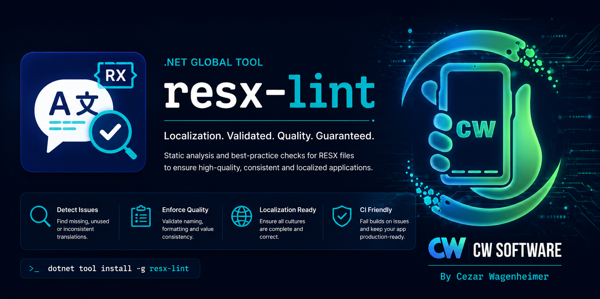

# resx-lint

A .NET global tool that validates `.resx` localization keys against XAML and C# usage. Auto-fixes common issues like duplicate keys, missing Designer.cs properties, and orphaned language entries.

## Install

```bash
dotnet tool install --global ResxLint
```

Or pin a version per-repo using a `dotnet-tools.json`:

```bash
dotnet new tool-manifest   # creates .config/dotnet-tools.json
dotnet tool install ResxLint
dotnet tool restore        # CI / new devs run this once
```

## Usage

```bash
resx-lint --project-dir <dir> --resx-file <path> [options]
```

| Option | Description |
|---|---|
| `--project-dir` | Root of the project (where `.xaml` and `.cs` files live) |
| `--resx-file` | Path to the base `.resx` file (e.g. `Resources/AppResources.resx`) |
| `--what-if` | Preview changes without writing any files |
| `--fail-on-warnings` | Treat TRANS006/TRANS007 as fatal errors |
| `--quiet` | Suppress OK and INFO messages |
| `--help` | Show help |

## MSBuild integration

Add to your `.csproj` to run on every build:

```xml
<Target Name="ValidateTranslations" BeforeTargets="Build">
  <Exec Command="resx-lint --project-dir &quot;$(ProjectDir)&quot; --resx-file &quot;$(ProjectDir)Resources\AppResources.resx&quot;" />
</Target>
```

For CI with strict mode:

```xml
<Exec Command="resx-lint --project-dir &quot;$(ProjectDir)&quot; --resx-file &quot;$(ProjectDir)Resources\AppResources.resx&quot; --fail-on-warnings" />
```

## Error codes

| Code | Description | Action |
|---|---|---|
| `TRANS001` | Key used in `{maui:Translate Key}` (XAML) not in base `.resx` | **Fatal** — fix manually |
| `TRANS002` | Duplicate key in any `.resx` | **Auto-fixed** |
| `TRANS003` | Key in base `.resx` without property in `Designer.cs` | **Auto-fixed** |
| `TRANS004` | Key used as `AppResources.Key` (C#) not in base `.resx` | **Fatal** — fix manually |
| `TRANS005` | Key in a language file not in base `.resx` | **Auto-fixed** (added to base with `[TRADUZIR]`) |
| `TRANS006` | Key in base `.resx` without translation in some language | **Warning** |
| `TRANS007` | Empty or placeholder value in base `.resx` | **Warning** |
| `TRANS008` | Value identical to base in all languages | **Info** |

## Exit codes

| Code | Meaning |
|---|---|
| `0` | All OK |
| `1` | Auto-fixes applied — restart the build |
| `2` | Invalid parameters |
| `3` | Fatal errors (TRANS001, TRANS004) |

## Errors shown in MSBuild format

Errors and warnings are emitted in `file(line): error CODE: message` format, so Visual Studio and Rider show them inline with clickable links.

## License

MIT
