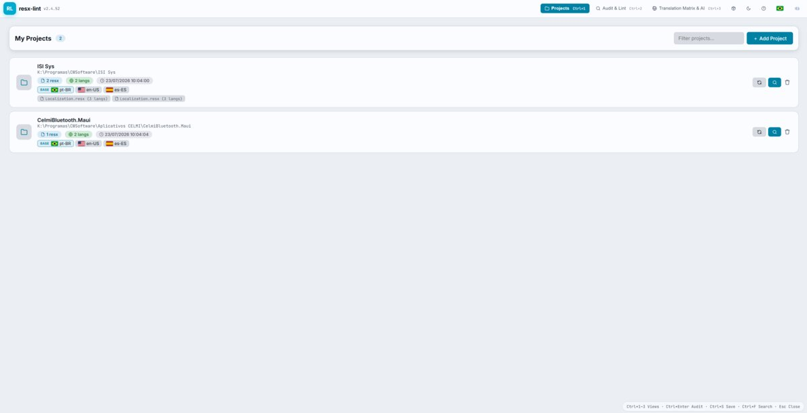
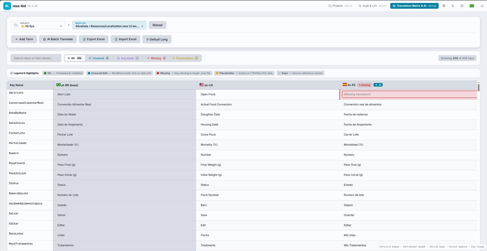
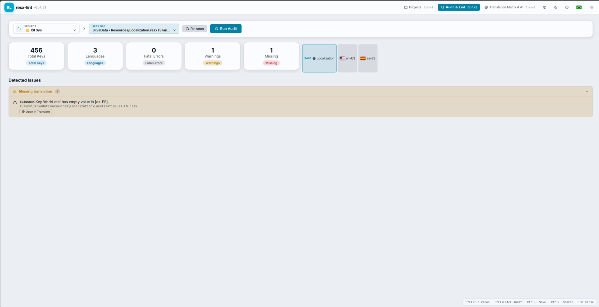
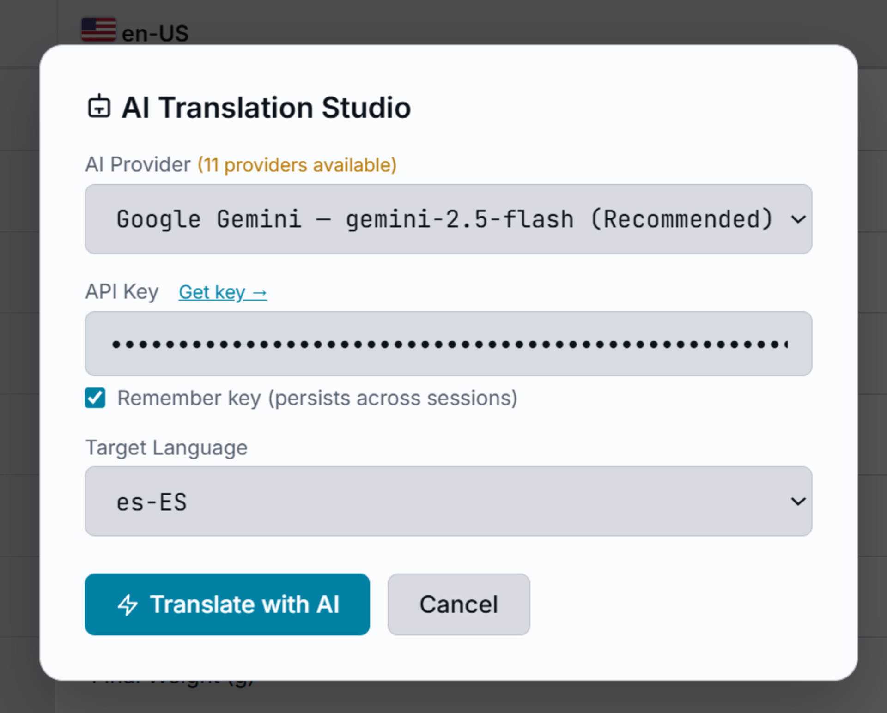

[](https://www.nuget.org/packages/ResxLint)
[](https://www.nuget.org/packages/ResxLint)
[](https://github.com/CW-Software-Apps/resx-lint/actions)
[](LICENSE)

**resx-lint** is more than a localization checker — it is a complete .resx quality and productivity tool for .NET apps.

It validates your localization keys against both XAML and C#, catching missing, duplicate, orphaned, and untranslated entries before they reach production. That means fewer runtime surprises, cleaner resource files, and a much more reliable localization workflow.

What makes resx-lint stand out is its **AI-powered translation workflow**. When keys are missing or placeholders need to be filled, the built-in web UI can automatically translate them using AI providers (OpenAI, Anthropic, Azure, Google, DeepSeek, or custom endpoints), helping you localize entire resource sets in seconds instead of manually editing each string one by one.

### Key Benefits

- Validates `.resx` files against real application usage in XAML and C#
- Detects missing, duplicate, **case-only duplicate**, orphaned, and untranslated keys
- Suggests likely matches for typos and naming mistakes
- `add-key`/`remove-key` commands that touch every language file + `Designer.cs` in one call — see [For AI Agents](#for-ai-agents)
- Offers automatic translation with AI for missing or incomplete entries
- Provides a fast, visual web UI editor for reviewing and applying changes
- Integrates cleanly with CLI, CI, and MSBuild
- Helps teams keep localization consistent across multiple languages and projects
- Built for speed and confidence

Whether you are maintaining a single app or a large multilingual product, resx-lint helps you keep translation files clean, accurate, and up to date. You can audit, fix, preview, and translate from one place — with AI doing the heavy lifting when you need to move fast.

---

## Features

### 🔍 CLI Linter
- **Static analysis** — scans `{maui:Translate Key}` in XAML and `AppResources.Key` in C#
- **Auto-fixes** — removes duplicate keys, adds missing `Designer.cs` properties, backfills orphaned language entries
- **Case-only duplicate detection** — catches `TipoDeServico` vs `TipoDeServiCO`: two keys that both compile fine but silently render `[MISSING: Key]` at runtime depending on which casing a binding happens to use (`TRANS009`)
- **MSBuild-native errors** — emits `file(line): error TRANS001: ...` for inline squiggles in VS/Rider
- **Similar key suggestions** — suggests closest matches for typos
- **`--what-if` mode** — preview every change without touching files
- **CI-friendly** — `--fail-on-warnings` escalates warnings to errors

### 🤖 `add-key` / `remove-key` — safe key management for AI agents and humans
- **`add-key`** — adds one key to the base `.resx` + every language `.resx` + `Designer.cs` in a single call; refuses outright if a case-variant of the key already exists instead of silently creating the `TRANS009` bug
- **`remove-key`** — deletes one exact key from every `.resx` + `Designer.cs`; optional `--project-dir` safety check refuses to remove a key still referenced in XAML/C#
- Both are idempotent, `--what-if`-able, and print copy-paste-ready `{maui:Translate Key}` / `AppResources.Key` usage — see **[For AI Agents](#for-ai-agents)** below

### 🖥️ Web UI Dashboard
- **Translation Matrix Editor** — edit all language cells side-by-side in a virtual-scrolled grid
- **🇧🇷 Language flags** — locale-to-flag conversion (Regional Indicator Symbols)
- **Configurable base language** — pick your source language (e.g. `pt-BR`) via searchable picker
- **Live missing count** — header badges update in real time as you type
- **AI batch translate** — translate missing/placeholder keys via OpenAI, Anthropic, Azure, Google, DeepSeek, or custom endpoints
- **Auto-fix preview & apply** — see what changes before writing to disk
- **Project manager** — save multiple projects, scan for `.resx` files, quick audit
- **Self-update** — one-click `dotnet tool update` inside the UI
- **Sound effects** — optional audio feedback on save, translate, and errors
- **Dark/Light theme** — persistent toggle
- **🔢 Keyboard shortcuts** — `Ctrl+1/2/3` views, `Ctrl+Enter` audit, `Ctrl+S` save, `Ctrl+F` search, `Esc` close modals
- **Export/Import Excel** — spreadsheet round-trip for translation managers
- **Virtual scrolling** — handles 10,000+ keys without freezing

---

## Screenshots

> TODO: Replace these placeholders with actual screenshots.

| Projects Dashboard | Translation Matrix |
|---|---|
| [](screenshots/projects.jpg) | [](screenshots/editor.jpg) |

| Lint Results | AI Translation Config |
|---|---|
| [](screenshots/lint.jpg) | [](screenshots/aiconfig.jpg) |

---

## Installation

### Global (local dev)

```bash
dotnet tool install --global ResxLint
```

### Per-repo (recommended for teams and CI)

```bash
dotnet new tool-manifest
dotnet tool install ResxLint
```

New devs and CI agents just run:

```bash
dotnet tool restore
```

---

## Usage

### Interactive Mode

```bash
resx-lint
```

Shows a 3-second prompt:
- Press **W** → opens the **Web UI** at `http://localhost:7950`
- Wait 3s → auto-detects a `.resx` in the current directory and runs the CLI lint

### CLI Lint

```bash
resx-lint --project-dir <dir> --resx-file <path> [options]
```

| Option | Description |
|---|---|
| `--project-dir <dir>` | Root of the project (where `.xaml` and `.cs` files live) |
| `--resx-file <path>` | Path to the base `.resx` file |
| `--what-if` | Preview all changes without writing any files |
| `--fail-on-warnings` | Treat TRANS006 and TRANS007 as fatal errors |
| `--quiet` | Suppress ✅ OK and ℹ INFO messages |
| `--help` | Show help and exit |

### Web UI

```bash
resx-lint --serve
```

Or press **W** in interactive mode. Opens at `http://localhost:7950`.

| Option | Description |
|---|---|
| `--port <port>` | Custom port (default: 7950) |
| `--no-open` | Don't open browser automatically |

### Update Check

```bash
resx-lint --check-update
```

Or click the version badge in the Web UI header.

### `add-key` — add one translation key, safely

```bash
resx-lint add-key <Key> --resx-file <path> --value "<base text>" [options]
```

| Option | Description |
|---|---|
| `--lang <code>=<text>` | Translation for one language file, repeatable (e.g. `--lang en-US="Service Type"`). Any sibling language file not covered gets a `[TRANSLATE: <base text>]` placeholder — never silently left out. |
| `--update` | Allow changing the value of a key that already exists under the *exact same* casing. Does **not** bypass the case-collision refusal below. |
| `--what-if` | Preview only — report what would change, write nothing. |

**Refuses outright** if a case-variant of the key already exists (e.g. you ask for `tipoDeServico` and `TipoDeServico` is already there) — that's the exact bug `TRANS009` exists to catch, and `add-key` makes it structurally impossible to reintroduce. See **[For AI Agents](#for-ai-agents)** for the full rationale and worked examples.

```bash
resx-lint add-key TipoDeServico --resx-file Resources/AppResources.resx \
  --value "Tipo de Serviço" \
  --lang en-US="Service Type" --lang es-ES="Tipo de Servicio"
```

### `remove-key` — delete one key everywhere

```bash
resx-lint remove-key <Key> --resx-file <path> [options]
```

| Option | Description |
|---|---|
| `--project-dir <dir>` | If given, refuses to remove a key still referenced in any `.xaml`/`.cs` under this directory. Omit to skip the check. |
| `--force` | Remove even if `--project-dir` found live references. |
| `--what-if` | Preview only. |

Case-insensitive as a *lookup convenience* only — if more than one case-variant exists (e.g. both `OK` and `Ok`), it refuses and lists them so you state the exact one to delete; it never guesses between two coexisting keys.

```bash
resx-lint remove-key TipoDeServiCO --resx-file Resources/AppResources.resx --project-dir .
```

---

## MSBuild Integration

Add this target to your `.csproj` to run validation on every build:

```xml
<Target Name="ValidateTranslationKeys" BeforeTargets="BeforeBuild">

  <!-- Friendly error if resx-lint is not installed -->
  <Exec Command="resx-lint --help"
        ConsoleToMSBuild="true"
        IgnoreExitCode="true"
        StandardOutputImportance="low"
        StandardErrorImportance="low">
    <Output TaskParameter="ExitCode" PropertyName="_ResxLintExitCode" />
  </Exec>
  <Error
    Condition="'$(_ResxLintExitCode)' == '9009' OR '$(_ResxLintExitCode)' == '127'"
    Text="resx-lint is not installed. Run: dotnet tool install --global ResxLint   |   Docs: https://github.com/CW-Software-Apps/resx-lint" />

  <!-- Run validation -->
  <Exec
    Command="resx-lint --project-dir &quot;$(MSBuildProjectDirectory)&quot; --resx-file &quot;$(MSBuildProjectDirectory)/Resources/AppResources.resx&quot;"
    ConsoleToMSBuild="true"
    IgnoreExitCode="false" />

</Target>
```

> **Linux / CI / Docker:** Always use **forward slashes** in the `--resx-file` path. `$(MSBuildProjectDirectory)/Resources/AppResources.resx` works on both Windows and Linux.

If the tool is not installed, the build stops with a clear message instead of the cryptic `exited with code 9009`.

For strict mode, add `--fail-on-warnings` to the `Exec` command.

---

## CI/CD Integration

### GitHub Actions

```yaml
- name: Validate translations
  run: resx-lint --project-dir . --resx-file Resources/AppResources.resx --fail-on-warnings
```

### Docker / Coolify

```dockerfile
RUN dotnet tool install --global ResxLint
ENV PATH="${PATH}:/root/.dotnet/tools"

COPY [".", "/src/app"]
RUN resx-lint --project-dir /src/app --resx-file /src/YourLibrary/Resources/AppResources.resx

RUN dotnet publish MyApp.csproj -f net10.0-android -c Release
```

Exit code `3` on fatal errors stops the Docker build, preventing broken deployments.

---

## Diagnostic Codes

| Code | Severity | Description | Action |
|---|---|---|---|
| `TRANS001` | ❌ Fatal | Key used in `{maui:Translate Key}` (XAML) not found in base `.resx` | Fix manually |
| `TRANS002` | 🔧 Auto-fix | Duplicate key found in a `.resx` file | Extra occurrences removed |
| `TRANS003` | 🔧 Auto-fix | Key in base `.resx` has no corresponding property in `Designer.cs` | Property added automatically |
| `TRANS004` | ❌ Fatal | Key accessed as `AppResources.Key` (C#) not found in base `.resx` | Fix manually |
| `TRANS005` | 🔧 Auto-fix | Key exists in a language file but not in the base `.resx` | Added to base with `[TRANSLATE]` placeholder |
| `TRANS006` | ⚠️ Warning | Key in base `.resx` has no translation in one or more language files | Add translation or escalate with `--fail-on-warnings` |
| `TRANS007` | ⚠️ Warning | Base `.resx` value is empty or a placeholder like `[TRANSLATE]` | Translation pending |
| `TRANS009` | 🔧 Auto-fix / ⚠️/❌ | Two keys in the base `.resx` differ **only in casing** (e.g. `TipoDeServico` vs `TipoDeServiCO`) — both compile fine as separate `Designer.cs` properties, so this silently ships `[MISSING: Key]` at runtime depending on which casing a binding happens to use | If exactly one variant is referenced anywhere: the unreferenced one is removed automatically. If neither is referenced: flagged as a warning, pick one to keep with `remove-key`. If **both** are referenced somewhere: flagged **fatal** — merge those usages onto one key first, resx-lint won't guess. |

Fatal errors (`TRANS001`, `TRANS004`, and an unresolved `TRANS009` where both variants are in active use) stop the build immediately. Auto-fixes (`TRANS002`, `TRANS003`, `TRANS005`, and the unambiguous case of `TRANS009`) modify files and return exit code `1` so MSBuild restarts the build to re-validate.

---

## For AI Agents

If you're an AI coding agent reading this because you're about to edit a `.resx` file: **don't hand-edit it. Use `add-key` / `remove-key` instead.** This section exists because that exact mistake is what `TRANS009` and these two commands were built to stop.

### Why hand-editing `.resx` files goes wrong

Every one of these compiles fine, passes code review, and only breaks at runtime as an unhelpful `[MISSING: Key]` on screen:

1. **Case-variant duplication** — you search the base `.resx` for `TipoDeServico`, don't find it (because it's actually there as `TipoDeServiCO`, or it's buried in a 5,000-line file), and add a new `<data name="TipoDeServico">`. Now two keys exist. `System.Resources.ResourceManager` is case-sensitive, so whichever casing your new XAML binding or `AppResources.X` call uses is the *only* one that resolves — the other sits there dead, or worse, is the one some other part of the app was already using.
2. **Forgetting a language file** — you add the key to the base `.resx` (the default/neutral culture) but forget `AppResources.en-US.resx` or `AppResources.es-ES.resx`. Nothing fails locally if your test device is on the default culture; it ships broken for every other language.
3. **Forgetting the `Designer.cs` property** — if the project's build doesn't run `resx-lint` as a pre-build step, `AppResources.Key` (C# access) won't compile at all until someone notices and adds the property by hand.

`add-key` makes all three structurally impossible in one call: it checks for a case-insensitive collision *before* writing anything (refuses instead of duplicating), writes the base `.resx` + every sibling language file it finds (backfilling untranslated ones with a `[TRANSLATE: ...]` placeholder instead of skipping them), and always appends the `Designer.cs` property.

### The workflow

1. **Check first, always** (costs nothing, writes nothing):
   ```bash
   resx-lint add-key MyNewKey --resx-file Resources/AppResources.resx --value "placeholder" --what-if
   ```
   If it refuses with a case-collision error, it just told you the exact existing key to reuse instead — use that, don't add anything.

2. **Add for real**, with as many language values as you already know:
   ```bash
   resx-lint add-key MyNewKey --resx-file Resources/AppResources.resx \
     --value "Texto em português" \
     --lang en-US="English text" --lang es-ES="Texto en español"
   ```
   It's fine to omit `--lang` entirely — every language file still gets the key, just with a `[TRANSLATE: ...]` placeholder that a later lint pass (`TRANS007`) will flag for follow-up, instead of the key being silently absent.

3. **Use the exact key it echoes back** in your XAML/C# edit — the command's last lines are always the copy-paste-ready usage:
   ```
   Use it as:
     XAML: {maui:Translate MyNewKey}
     C#:   AppResources.MyNewKey
   ```
   Don't retype the key name from memory into the XAML/C# file; copy it from this output. A single mistyped letter is exactly how a *new* case-variant duplicate gets created.

4. **Cleaning up a mistake** (e.g. you find you did create a near-duplicate before reading this): `remove-key` deletes one exact key everywhere in one call.
   ```bash
   resx-lint remove-key MyNewKey --resx-file Resources/AppResources.resx --project-dir .
   ```
   The `--project-dir` flag makes it refuse if that key is actually still referenced somewhere — you'd otherwise be creating a fresh `TRANS001`/`TRANS004`/`[MISSING: Key]` by deleting something in use.

5. **Before finishing your change**, run a full lint pass so anything these two commands didn't cover (existing `TRANS001`/`TRANS004`/`TRANS006` issues unrelated to your edit) is visible:
   ```bash
   resx-lint --project-dir . --resx-file Resources/AppResources.resx --what-if
   ```

### Never do this instead

- Don't `Edit`/`Write` a `<data name="...">` block into a `.resx` XML file directly, "just this once," because it seems faster than shelling out to a CLI tool. It is faster right up until it silently duplicates a key with different casing, or you forget one of three-plus language files — both are invisible until a user reports `[MISSING: Key]` weeks later.
- Don't guess a key's exact casing from memory when referencing it in XAML/C#. If you didn't just create it with `add-key` (which echoes the exact string), grep the base `.resx` for it, or run `add-key <guess> --what-if` and read the refusal message — it names the real key.
- Don't resolve a `TRANS009` finding by deleting whichever variant "looks newer" without checking usage first. `remove-key --project-dir` does that check for you; a coin-flip deletion is how a *working* binding gets broken.

---

## Exit Codes

| Code | Meaning |
|---|---|
| `0` | All OK — no issues found |
| `1` | Auto-fixes were applied — restart the build to re-validate |
| `2` | Invalid parameters, or `add-key`/`remove-key` refused (collision, not found, still in use) |
| `3` | Fatal errors found (TRANS001, TRANS004, or an unresolved TRANS009 case-collision) |

---

## Output Sample

```
═══ 4/6 Validating XAML usage ({maui:Translate}) ═══

Views/HomePage.xaml(42) : error TRANS001 : Translation key 'WelcomeTitel' not found in AppResources.resx. Similar keys: 'WelcomeTitle'.

──────────────────────────────────────────────────────────────
 SUMMARY — resx-lint
──────────────────────────────────────────────────────────────
  .resx base          : Resources\AppResources.resx
  Keys in base        : 312
  Languages           : 2  (AppResources.en-US.resx, AppResources.es-ES.resx)
  Auto-fixes applied  : 0
  Warnings            : 0
  Fatal errors        : 1
──────────────────────────────────────────────────────────────

  ✖ Build cancelled: 1 fatal error(s). Fix the missing keys and rebuild.
```

---

## Requirements

- .NET 10 SDK or later

---

## License

MIT © [CW Software](https://github.com/CW-Software-Apps)
